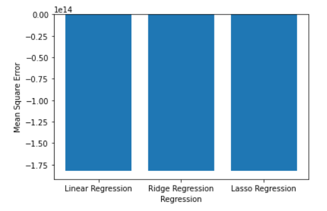

File "Accuracy_Result.PNG" contains accuracy results of train and test dataset for different models implemented in this project.
File "MSE_Result.PNG" contains mean square error comparison bar graph for linear regression, ridge regression and lasso regression.

| Model                                                         | Train Data Accuracy | Test Data Accuracy |
| ------------------------------------------------------------- | ------------------- | ------------------ |
| Linear Regression (Library)                                   | 54%                 | 47%                |     
| Linear Regression with Maximum Likelihood Estimation(Scratch) | 54%                 | 47%                |
| Gradient Boosting Regression                                  | 93%                 | 49%                |
| Polynomial Regression                                         | 64%                 | 63%                |
| Random Forest Regression                                      | 92%                 | 54%                |

## Mean Square Error Comparision

